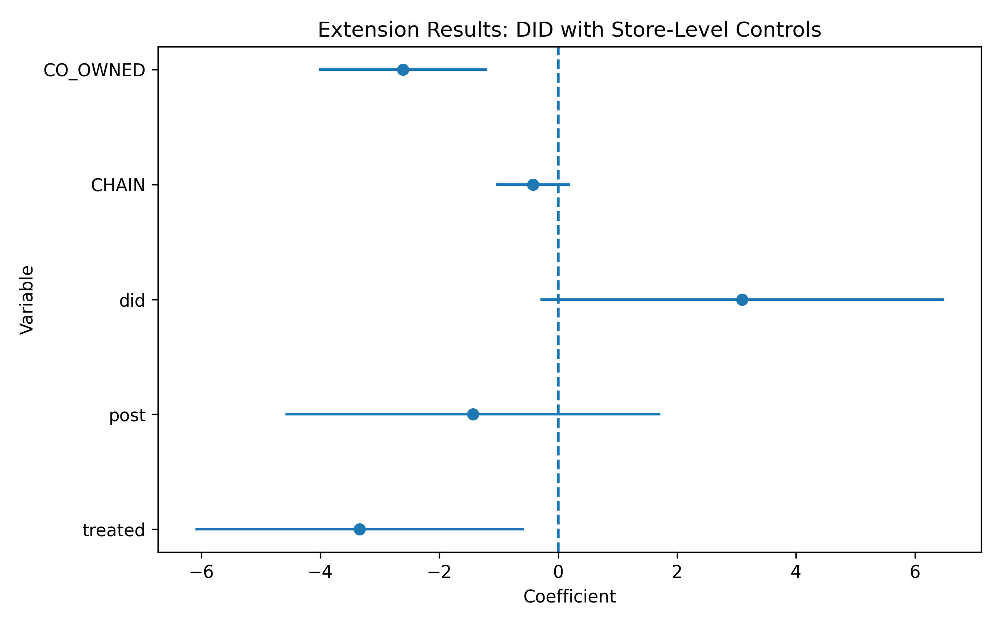

# Minimum Wage DID Replication & Extension

# Executive Memo

## Bottom Line Up Front (BLUF)

Our analysis finds that the New Jersey minimum wage increase did not reduce employment in fast-food restaurants. In fact, the estimated effect is slightly positive, suggesting that employment levels remained stable or even increased after the policy change.

The extended model, which controls for store-level characteristics, produces similar results, reinforcing the robustness of the original finding.

---

## The Mechanism (Intuition)

We use a Difference-in-Differences (DID) approach, which compares changes in employment over time between two groups:

- Treated group: New Jersey (policy change)
- Control group: Pennsylvania (no policy change)

This method mimics a natural experiment. Instead of randomly assigning treatment, we observe how employment changes before and after the policy in both states. The key idea is that Pennsylvania represents what would have happened in New Jersey if the policy had not been implemented.

---

## Visual Evidence



The figure below shows average employment (FTE) in New Jersey and Pennsylvania before and after the policy.

- Both states follow similar trends before the policy
- After the policy, New Jersey does not experience a decline in employment

This supports the validity of the DID assumption and our findings.

---

## Business / Policy Implications

The results suggest that moderate increases in minimum wage do not necessarily lead to job losses in the fast-food industry.

For policymakers:
- Minimum wage increases may improve worker welfare without harming employment

For businesses:
- Firms may adjust through other channels (e.g., prices, productivity) instead of reducing staff

## Project Overview

This project replicates and extends the analysis of Card and Krueger (1994), which examines the impact of a minimum wage increase on employment in the fast-food industry. The study compares fast-food restaurants in New Jersey (treatment group) and Pennsylvania (control group) before and after the 1992 minimum wage increase.

The main research question is:

> Does the increase in minimum wage in New Jersey affect employment in fast-food restaurants?

---

## Methodology

### Baseline Difference-in-Differences (DID)

The baseline model estimates the causal effect of the minimum wage increase using a Difference-in-Differences (DID) framework:

Y = β₀ + β₁ treated + β₂ post + β₃ (treated × post) + ε

* **treated**: indicator for New Jersey (treatment group)
* **post**: indicator for post-policy period
* **did**: interaction term (treated × post), capturing the treatment effect

The dependent variable is **full-time equivalent employment (fte)**, constructed as:

fte = EMPFT + 0.5 × EMPPT + NMGRS

---

## Data

The dataset contains store-level observations from fast-food restaurants in New Jersey and Pennsylvania. Key variables include:

* Employment: EMPFT, EMPPT, NMGRS
* Prices: PSODA, PFRY, PENTREE
* Store characteristics: CHAIN, CO_OWNED
* Treatment indicators: treated, post, did

---

## Phase 1: Data Preparation

* Loaded raw dataset and verified structure
* Cleaned variables and handled missing values
* Constructed the **fte** variable
* Exported cleaned dataset:

```
data/processed/njmin_panel_clean.csv
```

---

## Phase 2: Replication

### 1. Descriptive Statistics

Summary statistics were computed to understand the distribution of key variables.

### 2. Difference-in-Means

Calculated mean employment differences across groups and time periods.

### 3. DID Estimation

Estimated the baseline DID model using OLS with robust standard errors.

### 4. Clustered Standard Errors

Extended the model by clustering standard errors at the store level.

Outputs:

```
data/processed/table2_descriptive.csv
data/processed/did_cluster_results.csv
```

---

## Phase 3: Extension

### Extension Strategy

The baseline DID approach relies on the parallel trends assumption without explicitly validating it. To improve robustness, this project extends the analysis by incorporating store-level control variables.

### Extended Model

fte = β₀ + β₁ treated + β₂ post + β₃ did + β₄ controls + ε

Controls include:

* CHAIN (restaurant chain)
* CO_OWNED (ownership type)
* NREGS (store size proxy)

### Results

The estimated DID coefficient remains positive and statistically insignificant, suggesting that the minimum wage increase did not reduce employment.

Including control variables improves the robustness of the results by accounting for observable differences across stores.

---

## Visualization

A coefficient plot with 95% confidence intervals is generated to visualize the estimated effects:

```
data/processed/extension_coefficient_plot.png
```

---

## Key Findings

* The minimum wage increase in New Jersey did **not reduce employment** in fast-food restaurants
* Results are consistent across baseline and extended models
* Adding control variables does not change the overall conclusion

---

## Repository Structure

```
minimum-wage-did-replication/
├── README.md
├── data/
│   ├── raw/
│   └── processed/
│       ├── njmin_panel_clean.csv
│       ├── table2_descriptive.csv
│       ├── did_cluster_results.csv
│       ├── extension_results.csv
│       └── extension_coefficient_plot.png
└── notebooks/
    ├── 01_Data_Cleaning.ipynb
    ├── 02_Replication.ipynb
    └── 03_Extension_and_Results.ipynb
```

---

## Conclusion

This project replicates the core findings of Card and Krueger (1994) and extends the analysis by incorporating store-level controls. The results consistently show no evidence that the minimum wage increase reduced employment, supporting the original conclusion.

---
